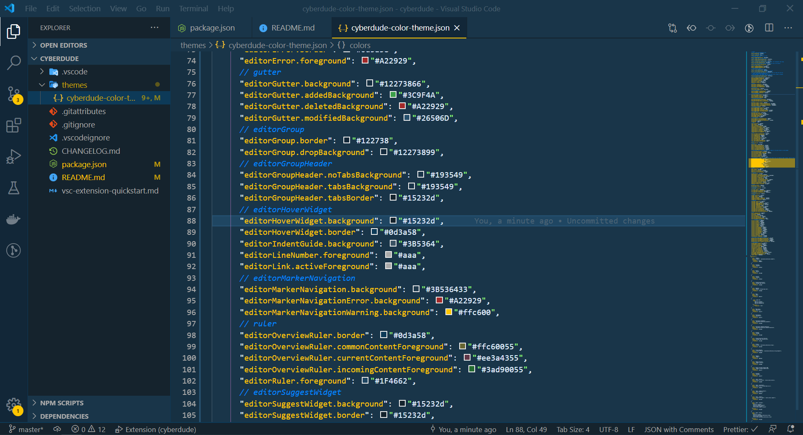

# CyberDude Theme for VS Code



# Installation

1. Open **Extensions** sidebar panel in VS Code. `View → Extensions`
2. Search for `Cyberdude` - find the one by **krishnaUIDev** - there are a few other half-baked ones so make sure you have the right one!
3. Click **Install** to install it.
4. Click **Reload** to reload the your editor
5. Code > Preferences > Color Theme > **Cyberdude**
6. Optional: Use the recommended settings below for best experience

## Recommended Settings

```js
{
  "workbench.colorTheme": "Cobalt2",
  // The Cursive font is operator Mono, it's $200 and you need to buy it to get the cursive
  "editor.fontFamily": "Operator Mono, Menlo, Monaco, 'Courier New', monospace",
  "editor.fontSize": 17,
  "editor.lineHeight": 25,
  "editor.letterSpacing": 0.5,
  "files.trimTrailingWhitespace": true,
  "editor.fontWeight": "400",
  "prettier.eslintIntegration": true,
  "editor.cursorStyle": "line",
  "editor.cursorWidth": 5,
  "editor.cursorBlinking": "solid",
  // Very important: Install this plugin: https://github.com/be5invis/vscode-custom-css
  // You'll need to change this to a file URI scheme on your computer: https://en.wikipedia.org/wiki/File_URI_scheme
  // Mac/Linux: file:///Users/YOUR-PC-USERNAME/.vscodestyles.css
  // Windows: file:///C:/Users/YOUR-PC-USERNAME/.vscodestyles.css
  "vscode_custom_css.imports": [
    "file:///Users/wesbos/.vscodestyles.css"
  ],
  "editor.renderWhitespace": "all",
}
```

## Contributing

This is a bit weird, but to get some sort of live feedback for when editing a theme. Please let me know if you have a saner way of doing it

1. Open this repo in your terminal and type `npm install`
1. Start to watch for change on the repo with `npm start` - this runs a nodemon task for you and will automatically recompile any changes
1. Open this repo in VS Code
1. Open your command palette and hit type **VSIX**. Select the one that says **Extensions: Install from VSIX...**
1. Load the VSIX file that was created a few steps back
1. Set your editor to use _this_ Cobalt2 theme - it might help to change the name in package.json to something like "Cobalt2 Dev" so you can differentiate from the Cobalt2 you've installed from the marketplace. If you get confused, just delete all traces of Cobalt2 and then load the VSIX.
1. Go to the debug sidebar `View → Debug`
1. Press the green arrow beside "Launch Extension"
1. This will then open a second window.
1. Make a change, and then hit the refresh button on your debug toolbar - this is in your first editor - not the one that poped open.
1. Wait a sec, your changes should now be reflected!

Whew. Again, if you have an easier way to style these things, let me know!

## I don't like something

First, this theme is new so if something is funky, please open an issue.

These are the things we have control over. If you would like to change something, you can either open a PR and see if I'd like it added, or override the colours in your own settings.json file.

https://code.visualstudio.com/docs/getstarted/theme-color-reference

## Thanks

Thanks to Roberto Achar for doing much of the initial porting to VS Code.
